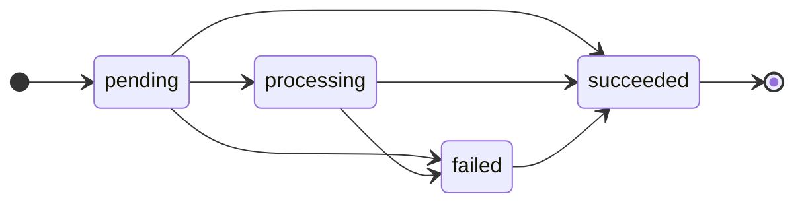

# Payment Flow Service — Design Doc

Source of truth for every behaviour in this repo. If code and this doc disagree, the code is wrong or the doc needs a deliberate change (see `.claude/skills/design-change`).

## Overview and scope

A small Express + TypeScript service records checkout intents as orders and applies payment-provider webhooks to them. It stays correct under retries, concurrent requests and late or out-of-order events. PostgreSQL, accessed through Drizzle, enforces every correctness rule with constraints and transactions.

**In scope:** three endpoints (create a checkout intent, receive a webhook, get an order), the PostgreSQL schema and migrations, Jest integration tests against real Postgres, and a Docker Compose setup.

**Out of scope (per the spec):** a UI, calls to a real provider, refunds, disputes, partial payments, multiple payment attempts per order, webhook authentication and signatures. Merchant authentication is also out of scope.

**Stack:** Express, TypeScript, PostgreSQL, Drizzle ORM (version pinned), Zod, Jest with supertest, pino for logs.

## API

Three endpoints, all JSON in snake_case. Zod validates every request; a validation failure returns `400` with the problems found.

### POST /orders: create a checkout intent

```json
{ "merchant_id": "m_123", "order_reference": "ORD-1001", "amount": 1999, "currency": "EUR" }
```

| Field | Rule |
| --- | --- |
| `merchant_id` | Non-empty string, at most 255 characters |
| `order_reference` | Non-empty string, at most 255 characters |
| `amount` | Integer in minor units, greater than 0, at most `Number.MAX_SAFE_INTEGER` |
| `currency` | Matches `^[A-Z]{3}$` (lowercase is rejected, not normalised) |

Every success response returns the order representation:

```json
{ "id": "7c1e…", "merchant_id": "m_123", "order_reference": "ORD-1001", "amount": 1999, "currency": "EUR", "status": "pending", "created_at": "2026-10-06T12:00:00Z", "updated_at": "2026-10-06T12:00:00Z" }
```

| Case | Status | Body |
| --- | --- | --- |
| New order | `201` | The order |
| Retry with matching `amount` and `currency` | `200` | The current order (its status may have advanced) |
| Retry with a different `amount` or `currency` | `409` | The mismatched fields; the existing order is unchanged |
| Validation failure | `400` | The validation problems |

### POST /webhooks/payments: receive a provider event

```json
{ "event_id": "evt_9f2a…", "order_id": "7c1e…", "status": "succeeded", "occurred_at": "2026-10-06T12:01:30Z" }
```

| Field | Rule | Why it is there |
| --- | --- | --- |
| `event_id` | String, 1–255 characters | The dedup key. Opaque provider ID: real providers use prefixed strings, not UUIDs. The cap bounds untrusted input and keeps index entries small. |
| `order_id` | UUID | Our order ID, which we would pass to the provider when creating the payment. Unique across the service, so no merchant is needed. |
| `status` | `processing`, `succeeded` or `failed` | The provider's vocabulary, mapped to our status enum while parsing. Each future provider gets its own map. |
| `occurred_at` | ISO 8601 timestamp | Stored for audit. Drives no logic. |

Deliberately left out: `amount` and `currency` (we assume the capture equals the order amount, since partial payments are out of scope), `failure_reason` and `provider_payment_id` (nothing reads them), and a provider field (one simulated provider).

A non-2xx response means "send this again later". We return `2xx` once our decision is durably recorded, and a non-2xx only when a retry could help.

| Case | Status | Why |
| --- | --- | --- |
| Applied, or ignored as stale or equal rank | `200` | Decision recorded. A stale event can never succeed on retry. |
| Duplicate, same payload | `200` | Already recorded |
| Duplicate, different payload | `200` + log | Never applied. A retry cannot fix it; it indicates a provider bug. |
| Malformed payload (including a non-UUID `order_id`) | `400` | Nothing recorded. A retry may succeed after we fix a schema bug. |
| Unknown `order_id` | `404` + log | Cannot legitimately happen. Retries keep it visible in the provider's dashboard and give us time to fix it. |
| Database error or crash | `500` | Nothing committed. A retry succeeds once the database is back. |

The body is always `{ "received": true }`, sent only after `COMMIT` succeeds.

### GET /orders/:id

Returns `200` with the order representation. A malformed or unknown ID returns `404`. The ID is validated as a UUID first, so Postgres never receives an invalid `uuid` value (which would surface as a `500`).

## Data model

Two tables and two Postgres enums: `payment_status` (`pending`, `processing`, `failed`, `succeeded`) and `event_outcome` (`applied`, `ignored`). Duplicate protection lives in constraints, not application checks.

### orders

| Column | Type | Notes |
| --- | --- | --- |
| `id` | `uuid` primary key | Default `gen_random_uuid()`: one source of truth, including rows inserted by tests or raw SQL |
| `merchant_id` | `text` not null | Part of the order's identity |
| `order_reference` | `text` not null | The merchant's order number |
| `amount` | `bigint` not null | Minor units; Drizzle `mode: 'number'` |
| `currency` | `text` not null | Three uppercase letters |
| `status` | `payment_status` not null | Default `pending` |
| `created_at` | `timestamptz` not null | Default `now()` |
| `updated_at` | `timestamptz` not null | Default `now()`; set to `now()` in the same `UPDATE` that changes status |

Constraints: `UNIQUE (merchant_id, order_reference)` and `CHECK (amount > 0)`.

**Where validation lives.** A non-positive amount is a money bug wherever the row comes from (raw SQL, a future endpoint), and the rule never changes, so the database enforces it as well as Zod. The currency format is input hygiene and stays in Zod only: a malformed currency can at worst cause a `409` mismatch, never a wrong amount, and the rule may later become an ISO 4217 allowlist that belongs in application code.

### webhook_events

| Column | Type | Notes |
| --- | --- | --- |
| `event_id` | `text` primary key | Already unique and never changes; nothing references event rows, so a surrogate key adds nothing |
| `order_id` | `uuid` not null | Foreign key to `orders(id)`; an event for an unknown order cannot be stored |
| `status` | `payment_status` not null | The provider status after mapping |
| `occurred_at` | `timestamptz` not null | Audit only |
| `outcome` | `event_outcome` not null | What we did with the event. A stale event and an equal-rank event are both `ignored`; the stored status beside the order's status shows which. |
| `received_at` | `timestamptz` not null | Default `now()`. When we got it, as opposed to when the provider says it happened. |

### Amounts

Amounts are integers in the currency's minor unit: `1000 EUR` is €10.00, `1000 JPY` is ¥1000, `1000 KWD` is 1.000 KWD.

- **Idempotency:** an integer has exactly one representation, so `"10.0"` against `"10.00"` never comes up when comparing checkout payloads.
- **Parsing:** a decimal sent as a JSON number is not exact in a double (`19.99 * 100` is `1998.9999999999998`).
- **Exponents are the client's concern.** The service only stores and compares integers and never converts to major units.
- **Range:** `bigint` in Drizzle's number mode, capped at `Number.MAX_SAFE_INTEGER` (about 9 × 10¹⁵) by validation. Precision is lost in `JSON.parse` before Zod runs, so a larger range would need amounts as strings end to end. No realistic checkout gets near the cap.

### Where order references are unique

Within one merchant: `UNIQUE (merchant_id, order_reference)`. Under service-wide uniqueness, merchant A sending `#1001` with the same amount as merchant B's `#1001` would be told "this is your existing order" and receive B's order ID, leaking data across merchants.

`merchant_id` is part of the identity, never part of the compared payload: the same reference from another merchant is a different order. There is no `merchants` table. Without authentication it would only prove that some merchant with that ID exists, not that the caller is that merchant.

### Immutability rule

After insert, `merchant_id`, `order_reference`, `amount` and `currency` never change, and orders are never deleted. Only `status` and `updated_at` change. The checkout design relies on this (see Checkout idempotency).

## Payment status model

Status only moves up: pending → processing → failed → succeeded. So the final status is the highest-ranked status among all distinct events received, whatever order they arrive in.



Every arrow points right: an event can only move an order to a higher-ranked status.

The transition table lives in TypeScript as `allowedTo`, keyed by the current status, listing the statuses it may move to. It reads like the state diagram above, and a terminal status is simply an empty list:

| Current status | May move to |
| --- | --- |
| `pending` | `processing`, `failed`, `succeeded` |
| `processing` | `failed`, `succeeded` |
| `failed` | `succeeded` |
| `succeeded` | Nothing (terminal) |

Nothing moves to `pending`: it is the initial status only.

An event whose target is not allowed from the current status is acknowledged with a `2xx`, recorded with outcome `ignored`, and leaves the order unchanged. It is never rejected: a non-2xx would make the provider retry for days something that can never succeed.

**Why each status exists**

- **`processing`** separates two kinds of stuck order. Stuck in `pending` means we never heard from the provider. Stuck in `processing` means the provider acknowledged the payment but never reported a result.
- **`succeeded` is terminal**, as the spec requires.
- **`failed` can become `succeeded`.** The provider is the authority on whether money moved: a provider-side timeout reported as failed may later go through. A false failure (customer charged, order shown failed) is the worse error. From our side this is still one payment attempt; the provider retrying internally is invisible to us.

**Ordering policy**

Events may arrive late, out of order or more than once. Ordering needs no timestamps, because arrival order cannot change the final status:

| Events received | Final status, in any order |
| --- | --- |
| processing, failed | failed |
| failed, succeeded | succeeded |
| processing, failed, succeeded | succeeded |

Conflicting outcomes under different event IDs (failed and succeeded) resolve to `succeeded`. A same-status event with a new event ID is a no-op, recorded as `ignored`. `occurred_at` is audit-only.

The table lives in application code, not in the enum's declaration order, so a future flow that isn't a straight line (refunds, disputes) can add edges such as `succeeded: ['refunded']` without changing how transitions are enforced.

## Checkout idempotency

The unique constraint on `(merchant_id, order_reference)` decides every checkout race. No explicit transaction is used.

1. `INSERT … ON CONFLICT (merchant_id, order_reference) DO NOTHING RETURNING *`.
2. A row comes back: we created the order, so return `201`.
3. No row comes back: `SELECT` the existing order by `(merchant_id, order_reference)` and compare `amount` and `currency`.
   - They match: return `200` with the current order.
   - They differ: return `409` with the mismatched fields. Nothing is written.

**Concurrent retries.** When two inserts with the same key overlap, the second blocks until the first commits or rolls back.

- First commits: the second sees the conflict. Its follow-up `SELECT` is a new statement, so under READ COMMITTED it gets a fresh snapshot that includes the committed row.
- First rolls back: the second's insert succeeds, so it becomes the creator and returns `201`.

**Why no transaction.** No rule spans the two statements. The `INSERT` is atomic on its own, and the `SELECT` reads fields that can never change (see the immutability rule). If an endpoint ever edits orders, revisit this.

**Alternatives rejected**

| Option | Problem |
| --- | --- |
| `SELECT`, then `INSERT` if not found | Both requests see nothing and both insert; the loser hits the unique constraint and returns `500` |
| `INSERT`, catch the unique violation, then `SELECT` | Inside a transaction the error aborts it, so the follow-up `SELECT` fails without a savepoint |
| `ON CONFLICT DO UPDATE SET <no-op> RETURNING *` | Writes a new row version and takes a lock just to read, and can't easily tell new from existing |

## Webhook processing

Each webhook is one synchronous transaction that locks the order row first, and a `2xx` is returned only after `COMMIT` succeeds.

1. Validate the payload with Zod. On failure, return `400` without touching the database.
2. `BEGIN` (READ COMMITTED).
3. `SELECT … FROM orders WHERE id = $order_id FOR NO KEY UPDATE`. No row: end the transaction, log it, return `404`.
4. Map the provider status to our enum. Decide the outcome: `applied` if the target is in `allowedTo[current]`, otherwise `ignored`.
5. `INSERT INTO webhook_events (…, outcome) … ON CONFLICT (event_id) DO NOTHING RETURNING`.
   - No row comes back, so this is a duplicate. Read the stored event and compare `order_id` and `status`. Match: return `200`. Differ: log the conflict and return `200`. In both cases the order is untouched and nothing is written.
6. If the outcome is `applied`: `UPDATE orders SET status = $target, updated_at = now() WHERE id = $order_id`.
7. `COMMIT`, then return `200 { "received": true }`.

**Why lock the order first** rather than insert the event first:

- The event row is written once, with its final outcome. There is no nullable column or placeholder to update afterwards.
- Locks are taken in one simple order: the order row, then the event key.
- Deciding before knowing whether the event is a duplicate is safe. The decision has no effect until the event insert succeeds, and the order's status cannot change while we hold its lock.
- An unknown order is found before any insert. Inserting the event first would hit the foreign key and throw.

**Duplicate detection**

- **Key:** `event_id`, unique across the service, because there is one provider. With several providers the key becomes `(provider, event_id)`, since IDs are only unique within one provider's namespace. The provider would come from the endpoint or credentials, never from the payload.
- **What is compared:** only `order_id` and `status`, the fields that change what we do. `occurred_at` drives no logic, so a difference in it cannot change the outcome. Stored columns are compared directly; no hash is needed.
- **Same ID, different payload:** acknowledged with `200`, never applied, logged for us. The provider learns nothing from a `2xx`; returning an error would only start a retry loop that can never succeed. This should be rare, since it means the provider has a bug.

## Concurrency control

The database decides every race: unique constraints for duplicates, a row lock for status changes, all at READ COMMITTED isolation.

| Race | Mechanism | Result |
| --- | --- | --- |
| Identical checkouts at once | `UNIQUE (merchant_id, order_reference)` + `ON CONFLICT DO NOTHING` | One `201`, the rest `200`, one row |
| The same event delivered at once | Order row lock, then the `event_id` primary key + `ON CONFLICT DO NOTHING` | One event row, applied once |
| Different events for the same order at once | `SELECT … FOR NO KEY UPDATE` on the order | Highest rank wins |

**Why a lock is needed.** Opening a transaction locks nothing, and a plain `SELECT` takes no row lock. Without a lock, two webhooks both read `pending`, both pass the transition check, and the last write wins. `processing` could then overwrite `succeeded`.

**Why `FOR NO KEY UPDATE`, not `FOR UPDATE`.** A key column is one with a unique index a foreign key could reference. Our `UPDATE` changes only `status`, so it takes `NO KEY UPDATE` anyway; `FOR UPDATE` signals a delete or a key change, which we never do. It also conflicts with the `FOR KEY SHARE` lock that the foreign key check takes when an event row is inserted. If two transactions inserted events first and then asked for `FOR UPDATE`, each would wait on the other's `KEY SHARE`: a deadlock that Postgres breaks after about a second by aborting one transaction. `NO KEY UPDATE` does not conflict with `KEY SHARE`, so that cannot happen.

**Why the waiting transaction sees fresh data.** When a blocked `SELECT … FOR NO KEY UPDATE` is granted the lock, it returns the latest committed version of the row, not the version from when the statement started. A plain `SELECT` would return the stale value.

**Walkthrough:** `processing` (P) and `succeeded` (S) arrive together for a pending order, and S locks first.

```
S:  BEGIN; SELECT order FOR NO KEY UPDATE → granted → pending → succeeded allowed
P:  BEGIN; SELECT order FOR NO KEY UPDATE → blocks until S's transaction ends
S:  INSERT event (applied) → UPDATE status = succeeded → COMMIT → 200
P:  lock granted → re-reads the row → succeeded → processing not allowed
P:  INSERT event (ignored) → no UPDATE → COMMIT → 200
Final: succeeded
```

- **S rolls back instead:** P sees `pending` and applies `processing`. Correct, because S never happened.
- **P locks first:** P applies `processing`, then S sees `processing` and applies `succeeded`. The final status is `succeeded` either way.

Locks are held until the transaction ends, so P waits for S's commit, not just its `UPDATE`.

**Why READ COMMITTED.** The locking select re-reads the latest committed row after waiting. Under REPEATABLE READ it would instead fail with a serialization error, and every webhook would need a retry loop.

**Alternative considered:** a conditional `UPDATE … WHERE id = $id AND status = ANY($statusesThatMayMoveToTarget) RETURNING id`, with zero rows meaning ignored. It is equally correct in one statement. The explicit lock was chosen because it is easier to reason about and defend, gives the current status for logging why an event was ignored, and leaves room for checks between the read and the write.

## Failure handling

The event row and the order update commit or roll back together, and a `2xx` goes out only after `COMMIT`. So every failure either leaves nothing behind or leaves a complete, already-acknowledged result.

| Failure | What is persisted | Response | What happens next |
| --- | --- | --- | --- |
| Payload fails validation | Nothing | `400` | The provider retries; it succeeds only after we fix a schema bug |
| Order not found | Nothing | `404` | The provider retries; failed deliveries show in its dashboard |
| Crash, dropped connection or database error before `COMMIT` | Nothing: event row and order update roll back together | `500`, or no response | The provider resends the same event (same `event_id`), processed exactly like a first delivery |
| `COMMIT` succeeds, response lost | Event row and order update | None received | The retry conflicts on `event_id`, payloads match, `200`: applied exactly once |
| Same `event_id`, different payload | Nothing new | `200` + log | Delivery stops; we investigate with the provider |

**Why one transaction matters.** If the event insert committed separately from the order update, a crash between them would leave the event recorded but never applied. The provider's retry would look like a duplicate, get a `200`, and the status change would be lost for good. One transaction makes that state impossible.

## Testing strategy

Jest integration tests run against real Postgres, and each concurrency test is built so it cannot pass by luck.

**Environment**

- A separate `payments_test` database, so tests never touch dev data.
- Jest `globalSetup` runs Drizzle's `migrate()` once, so tests use the same migration files a reviewer applies.
- `TRUNCATE webhook_events, orders CASCADE` before each test, with `--runInBand`. Rolling back a per-test transaction cannot work: concurrent tests need the app to open many connections and really commit. Parallel Jest workers would truncate each other's data.
- `supertest` against the Express app in-process.

**Making overlap real**

- **Pool size 20** for 10 concurrent requests. With a pool smaller than the request count, requests queue in Node and Postgres never sees them overlap. Requests blocked on a row lock still hold their connection.
- **`TEST_TX_DELAY_MS`** makes the webhook handler sleep after taking the order lock and before `COMMIT`, so every other request arrives while the lock is held. The app refuses to start if it is set while `NODE_ENV` is not `test`.
- **Break-it check**, done once by hand and noted in the README: replace `FOR NO KEY UPDATE` with a plain `SELECT` and confirm the race B test fails; restore it and confirm it passes.

**Tests**

| Test | Rule it proves | HTTP assertions | Database assertions |
| --- | --- | --- | --- |
| 1. 10 concurrent identical checkouts | No duplicate orders | Exactly one `201`, nine `200`, all with the same order ID | One order row |
| 2. Same event delivered 10 times concurrently | An event is applied once | All `200` | One event row, outcome `applied`; order at target status |
| 3. Reused reference, different amount | Mismatches rejected without change | `409` | Order unchanged: original amount and currency, one row |
| 4a. `failed` (new event ID) after `succeeded` | Success is terminal | `200` | Order `succeeded`; event recorded `ignored` |
| 4b. Same event ID, different status | Changed payload never applied | `200` | Still one row with the original status; order unchanged |
| 4c. `processing` after `succeeded` | Stale events ignored | `200` | Order `succeeded`; event recorded `ignored` |
| 5. Same reference, different merchant | References unique per merchant | `201` | Two orders |
| 6. `failed`, then `succeeded` | Failed can become succeeded | `200`, `200` | Order `succeeded` |
| 7. Race B: `processing` and `succeeded` concurrently, with the delay | Concurrent webhooks keep valid status changes | All `200` | Order `succeeded`; one event `applied`, one `ignored` |

Test 7 is the only evidence for the spec's concurrent-webhook rule, and the only test that exercises the lock.

**Why one event row proves one application:** the event insert and the order update are in the same transaction. A row cannot exist without its update, and an update cannot happen without its row, so the row count is the application count. The order's status alone cannot show this, because applying `succeeded` twice still gives `succeeded`.

## Local setup

A reviewer needs only Docker: `docker compose up --build` starts Postgres, applies migrations and serves the API.

**Compose services**

- **`db`:** Postgres (version pinned), port 5432 exposed, a `pg_isready` healthcheck. An init script in `/docker-entrypoint-initdb.d/` creates `payments_test`. Postgres runs it only when the data volume is empty.
- **`app`:** built from one Dockerfile that installs all dependencies, Jest included. It waits for `db` with `depends_on: condition: service_healthy`, runs Drizzle's `migrate()` on startup, then listens on `PORT`.

**Commands**

```bash
cp .env.example .env
docker compose up --build                     # start: migrate + serve
docker compose run --rm app npm test          # run the tests in a container
docker compose down -v && docker compose up --build   # reset: -v deletes the volume, so the init script runs again
```

With the port exposed, `npm test` on the host also works for day-to-day development.

**Configuration (`.env.example`)**

| Key | Purpose |
| --- | --- |
| `DATABASE_URL` | The app's database |
| `TEST_DATABASE_URL` | The test database, `payments_test` |
| `PORT` | HTTP port |
| `DB_POOL_SIZE` | Connection pool size (tests use 20) |

`TEST_TX_DELAY_MS` is deliberately absent. Only the test setup sets it, because it holds a row lock open on purpose.

**Calling the API and simulating the provider**

- `scripts/send-webhook.sh <order_id> <status>` sends a webhook with a generated event ID.
- `request.http` covers every endpoint (needs the VS Code REST Client or a JetBrains IDE). Its fixed `event_id` demonstrates the duplicate path when sent twice.
- The README also gives plain `curl` examples for reviewers without either.

## Trade-offs, limitations and production improvements

The main gap is authentication: everything else here is a deliberate simplification documented for the reviewer.

**Known limitations**

- **No authentication.** `merchant_id` is trusted client input, so anyone can probe any merchant's references and amounts. `GET /orders/:id` is open.
- **No amount check on webhooks.** We assume the capture equals the order amount, so a provider charging the wrong amount goes undetected.
- **One provider.** The dedup key is `event_id` alone.
- **Problems only in logs.** Conflicting payloads and unknown orders are logged; nothing alerts on them.
- **Stuck orders are not detected.**

**Before production**

- **Authentication:** API keys mapped to merchants; webhook signature verification; provider identity taken from the endpoint or credentials; dedup key `(provider, event_id)`. A `merchants` table becomes meaningful once auth exists.
- **A `payments` table** separate from orders, holding `authorized_amount` and `captured_amount`, with `authorized → captured` statuses, partial captures, refunds and disputes. The transition table in application code already allows non-linear edges.
- **Migrations as a separate deploy step.** Several instances running `migrate()` on startup would race.
- **A multi-stage Docker image** without dev dependencies.
- **Metrics and alerts** for conflicting payloads, unknown orders and `5xx` responses, plus a query on `updated_at` age to find orders stuck in `pending` or `processing`.
- **ISO 4217 allowlist and exponent checks** if the service ever formats or converts amounts.

## Open questions

Decisions not yet made. An agent must not resolve these on its own; ask the human (see `.claude/skills/design-change`).

None at the moment. (Resolved: database CHECK on `amount > 0`, currency format in Zod only; see Data model › orders.)
